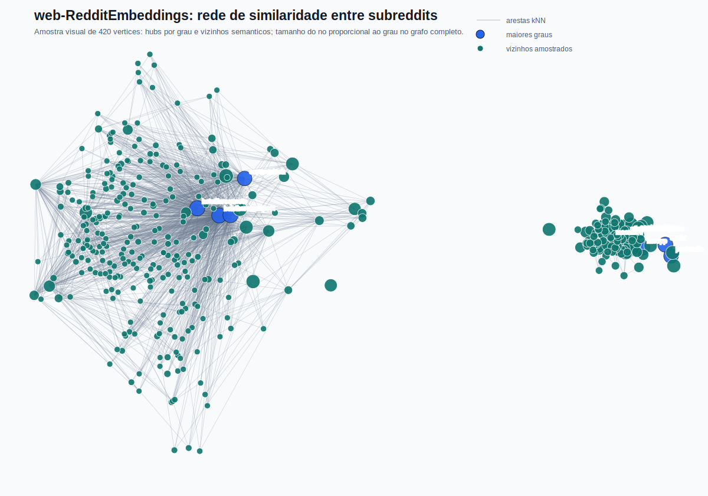
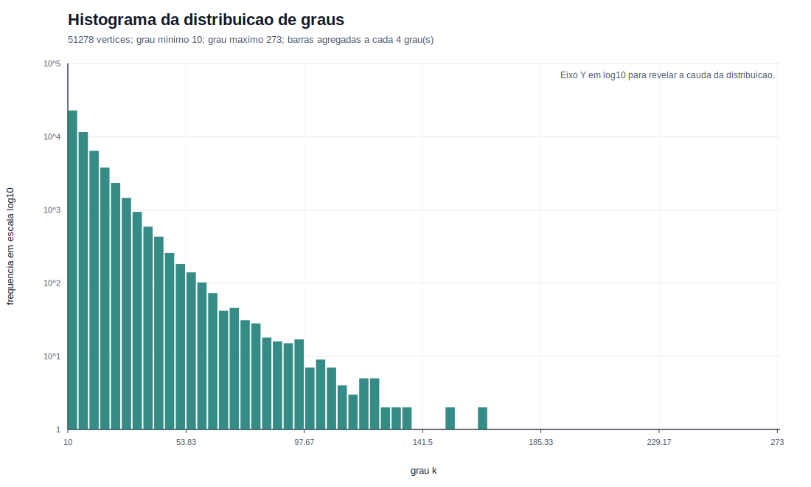
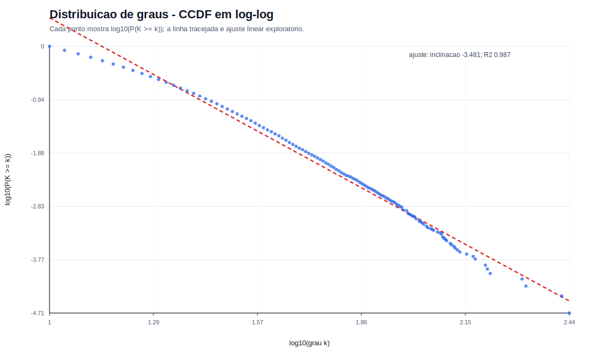
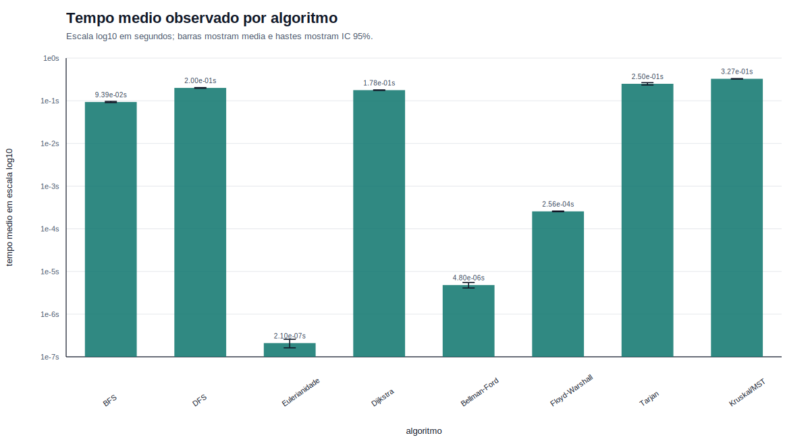
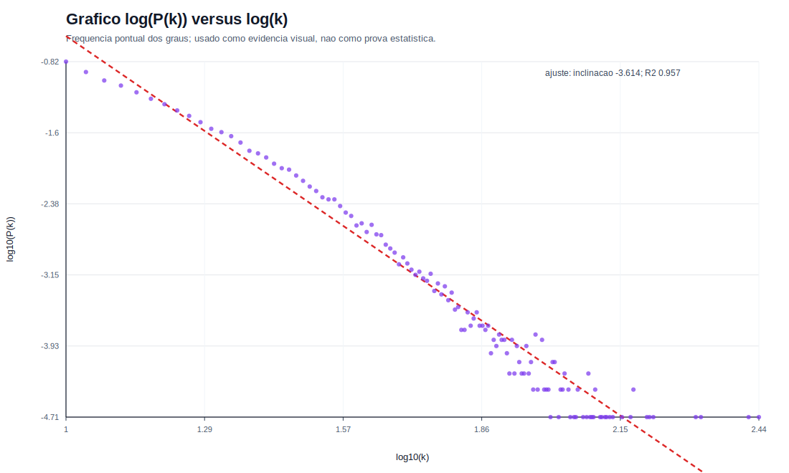
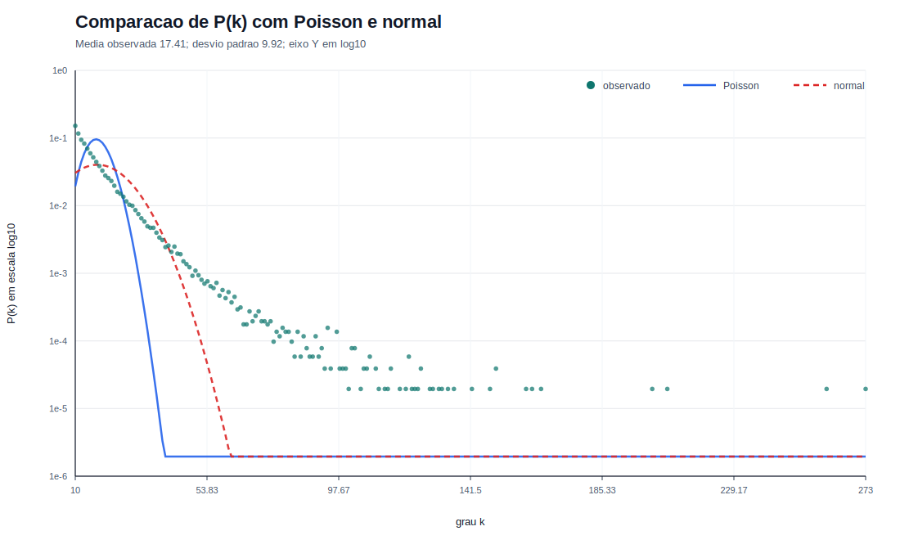
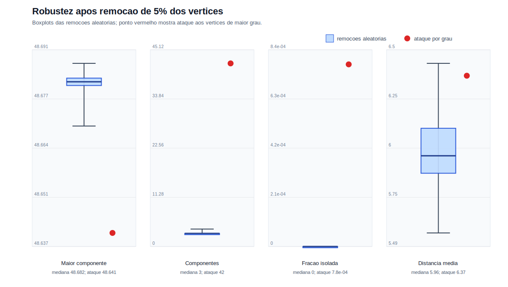

# Analise de Grafos: web-RedditEmbeddings (grafo tratado com todos os subreddits)

## Resumo

Este relatorio analisa o dataset **web-RedditEmbeddings** do SNAP como uma rede de similaridade entre subreddits. Como o arquivo original contem embeddings e nao uma lista explicita de arestas, o grafo foi construido por k-vizinhos mais proximos usando similaridade de cosseno. As conclusoes se referem ao **grafo tratado com todos os 51278 subreddits carregados do arquivo oficial do SNAP**. A rede tratada tem **51278 vertices**, **446502 arestas**, densidade **0.000340**, comprimento medio **5.7044** (media das fontes amostradas com IC 95% +/- 0.1980), clusterizacao media **0.2272** e **531941 triangulos**.

## 1. Introducao

O objetivo do trabalho e aplicar conceitos de Teoria dos Grafos e Redes Complexas a um grafo real: tratamento de dados, analise estrutural, execucao de algoritmos classicos, small-world, lei de potencia, robustez e comparacao com modelos classicos. Todos os valores numericos foram extraidos dos artefatos do projeto, principalmente `results/analysis_results.json`, `results/benchmark_times.csv`, `results/benchmark_raw_times.csv` e `results/degree_distribution.csv`.

## 2. Descricao do grafo original

O dataset oficial e **web-RedditEmbeddings**, da categoria **Online communities**, com tipo **Reddit Embeddings**. A pagina do SNAP informa **118.381 usuarios**, **51.278 subreddits**, embeddings de **300 dimensoes** e dados extraidos de **janeiro de 2014 a abril de 2017**.

Fonte oficial: <https://snap.stanford.edu/data/web-RedditEmbeddings.html>

Arquivos brutos preservados:

- `data/raw/web-redditEmbeddings-subreddits.csv`
- `data/raw/web-redditEmbeddings-users.csv`

## 3. Determinacao do grafo pela matricula

A matricula informada no enunciado e **224116475**. A regra usada para determinar o grafo e:

```text
f(M) = ((soma dos digitos de M) x (ultimos dois digitos de M + 1)) mod 129
```

Calculo passo a passo:

1. Matricula usada: **224116475**.
2. Soma dos digitos: **32**.
3. Ultimos dois digitos: **75**.
4. Ultimos dois digitos + 1: **76**.
5. Multiplicacao: **32 x 76 = 2432**.
6. Resultado do modulo 129: **2432 mod 129 = 110**.
7. Grafo final escolhido: **G110**.

Assim, a matricula determina a posicao do grafo em uma lista de 129 possibilidades. Para esta entrega, o grafo **G110** corresponde ao dataset recebido no enunciado: **web-RedditEmbeddings**.

## 4. Tratamento dos dados

O SNAP disponibiliza embeddings, nao uma lista pronta de arestas. Por isso, o tratamento necessario foi transformar vetores em uma rede de similaridade entre comunidades.

| Etapa | Tratamento aplicado | Antes | Depois | Justificativa | Impacto |
|---|---|---:|---:|---|---|
| Fonte bruta | Download e preservacao dos CSVs oficiais | 2 arquivos remotos | 2 arquivos em `data/raw` | garantir reproducibilidade | nao altera metricas |
| Escolha de vertices | Subreddits como vertices | 118.381 usuarios e 51.278 subreddits | 51.278 subreddits candidatos | foco em comunidades online | usuarios nao entram como vertices |
| Uso de vertices | Todos os subreddits do CSV oficial | 51.278 candidatos | 51278 vertices | atender a exigencia de usar todos os vertices disponiveis | elimina a amostragem de vertices |
| Normalizacao | vetores com norma 1 | embeddings de 300 dimensoes | embeddings normalizados | calcular similaridade de cosseno por produto interno | nao muda n; prepara arestas |
| Construcao de arestas | kNN por similaridade de cosseno | sem arestas explicitas | 446502 arestas | transformar embeddings em grafo analisavel | define topologia |
| Simplificacao | uniao de pares kNN em grafo simples | vizinhancas direcionais possiveis | grafo simples nao direcionado | metricas exigidas assumem grafo simples | remove duplicidade de pares |
| Pesos | `1 - similaridade` | similaridade de cosseno | pesos nao negativos | menor peso indica maior semelhanca | permite Dijkstra/MST |
| Componentes | verificacao de conectividade | grafo tratado | 3 componentes; maior com 51245 vertices | identificar a estrutura conexa usada nos caminhos | caminhos calculados por amostragem de fontes devido ao tamanho do grafo |

**Descricao do grafo tratado.** A versao analisada e uma rede simples, nao direcionada e ponderada de similaridade entre comunidades do Reddit. Cada vertice representa um subreddit; duas comunidades sao conectadas quando uma aparece entre os vizinhos semanticamente mais proximos da outra. Para metricas estruturais classicas, o grafo foi considerado sem peso; para algoritmos de caminho ponderado e MST, foi usado `1 - similaridade`.

## 5. Metodologia

As metricas estruturais foram calculadas sobre a versao nao ponderada quando a definicao classica depende do numero de arestas. Dijkstra, Bellman-Ford, Floyd-Warshall e Kruskal usaram pesos. Diametro, raio e comprimento medio dos caminhos foram estimados por **16 fontes** na maior componente por causa do tamanho do grafo; nessa situacao, diametro e raio sao valores observados na amostra, e o comprimento medio tem IC 95% **+/- 0.1980**. Cada algoritmo foi executado **30** vezes. Conforme o enunciado, os intervalos de confianca de 95% usam **Normal/Z quando n >= 30** e **t-Student quando n < 30**; nesta execucao, os benchmarks usaram **Normal/Z**. Os tempos individuais de cada repeticao foram exportados em `results/benchmark_raw_times.csv`, enquanto `results/benchmark_times.csv` contem media, desvio padrao e IC 95%.

## 6. Analise estrutural obrigatoria

| Medida | Valor | Computada? | Interpretacao | Justificativa, se nao computada |
|---|---:|---|---|---|
| Numero de vertices | 51278 | Sim | quantidade de subreddits usados do arquivo oficial | N/A |
| Numero de arestas | 446502 | Sim | pares de comunidades semanticamente proximas | N/A |
| Grau minimo | 10 | Sim | efeito esperado do kNN com k=10 | N/A |
| Grau maximo | 273 | Sim | existe ao menos um hub semantico muito conectado | N/A |
| Grau medio | 17.4150 | Sim | rede esparsa, mas com conexoes suficientes para formar uma componente gigante | N/A |
| Distribuicao de graus | `results/degree_distribution.csv` | Sim | cauda pesada e hubs aparecem na frequencia dos graus | N/A |
| Densidade | 0.000340 | Sim | apenas pequena fracao dos pares possiveis esta conectada | N/A |
| Numero de componentes conexas | 3 | Sim | ha uma componente gigante com 51245 vertices e 2 componentes pequenas | N/A |
| Tamanho de cada componente | 51245, 18, 15 | Sim | a maior componente concentra quase todos os vertices, mas o grafo nao e totalmente conectado | N/A |
| Diametro | 13 | Sim | limite inferior observado por amostragem no modo sampled | N/A |
| Raio | 10 | Sim | limite superior observado por amostragem no modo sampled | N/A |
| Comprimento medio dos caminhos | 5.7044 +/- 0.1980 | Sim, modo sampled | poucos intermediarios separam comunidades | N/A |
| Clusterizacao media | 0.2272 | Sim | ha forte agrupamento local | N/A |
| Numero de triangulos | 531941 | Sim | muitas triplas de subreddits semanticamente proximos | N/A |
| Visualizacao do grafo | `results/graph_visualization.svg` | Sim, reduzida | amostra visual para evitar sobreposicao excessiva | N/A |







## 7. Algoritmos da disciplina

| Algoritmo | Objetivo, funcionamento e condicoes | Complexidade teorica |
|---|---|---|
| BFS | visita a origem, depois seus vizinhos, depois os vizinhos dos vizinhos; aplicavel para medir alcancabilidade em grafos ponderados ou nao ponderados quando o peso nao importa | O(V + E) |
| DFS | explora um ramo ate o fim antes de retroceder; aplicavel para percorrimento e base de analises de conectividade | O(V + E) |
| Eulerianidade | checa se o grafo nao direcionado e conectado e se todos os graus sao pares | O(V + E) |
| Dijkstra | relaxa arestas em ordem de distancia minima por fila de prioridade; aplicavel porque `1 - similaridade` e nao negativo | O((V + E) log V) |
| Bellman-Ford | relaxa todas as arestas repetidamente e tolera pesos negativos; aqui e aplicavel, mas redundante, pois nao ha pesos negativos | O(VE) |
| Floyd-Warshall | atualiza uma matriz de distancias considerando cada vertice como intermediario; aplicavel conceitualmente, mas caro no grafo completo | O(V^3) |
| Tarjan | usa tempos de descoberta e valores `low-link` para identificar pontos de articulacao e pontes na versao nao direcionada | O(V + E) |
| Kruskal/MST | ordena arestas por peso e une componentes com union-find ate formar a MST; se o grafo for desconexo, o resultado e uma floresta geradora minima | O(E log E) |

| Algoritmo | Aplicavel? | Complexidade teorica | Tempo medio (s) | Desvio padrao (s) | IC 95% (s) | Resultado principal | Interpretacao |
|---|---|---|---:|---:|---:|---|---|
| BFS | Sim | O(V + E) | 0.093890 | 0.008430 | +/- 0.003017 | 51245 | alcancou a componente da origem |
| DFS | Sim | O(V + E) | 0.200372 | 0.010345 | +/- 0.003702 | 51245 | confirma percorribilidade da componente da origem |
| Verificacao de Eulerianidade | Sim | O(V + E), considerando checagem de conexidade e graus pares | 0.000000 | 0.000000 | +/- 0.000000 | False | resultado falso por haver vertices de grau impar |
| Dijkstra | Sim | O((V + E) log V) com heap binario | 0.177694 | 0.006897 | +/- 0.002468 | 51245 | menores caminhos ponderados aplicaveis com pesos nao negativos |
| Bellman-Ford (subgrafo) | Sim, em subgrafo | O(VE) | 0.000005 | 0.000002 | +/- 0.000001 | 1 | executado em subgrafo; redundante frente ao Dijkstra, mas valido |
| Floyd-Warshall (subgrafo) | Sim, em subgrafo | O(V^3) | 0.000256 | 0.000014 | +/- 0.000005 | 70 | limitado a subgrafo por custo cubico no grafo completo |
| Tarjan | Sim | O(V + E) | 0.250317 | 0.044932 | +/- 0.016079 | [5, 1] | identificou pontos de articulacao e pontes |
| Kruskal/MST | Sim | O(E log E) | 0.327248 | 0.012688 | +/- 0.004540 | 51275 | gera MST se conectado; caso contrario, floresta geradora minima |



Interpretacao dos resultados:

- BFS alcancou 51245 vertices e DFS alcancou 51245, isto e, a componente da origem usada nos testes.
- O grafo nao e euleriano, pois nem todos os vertices tem grau par.
- Dijkstra alcancou 51245 vertices com pesos nao negativos, correspondentes a componente da origem.
- Bellman-Ford foi executado em subgrafo de 120 vertices e Floyd-Warshall em subgrafo de 70 vertices, com justificativa tecnica de custo.
- Tarjan encontrou **5** pontos de articulacao e **1** ponte(s).
- Kruskal gerou uma **floresta geradora minima** com **51275** arestas e peso total **3127.7570**.

## 8. Analise de small-world

Pergunta obrigatoria: **o grafo apresenta indicios de propriedade small-world? Faz sentido para seu grafo? Qual e a implicacao pratica?**

| Metrica | Grafo real | Grafos aleatorios equivalentes (5 execucoes) | Comparacao |
|---|---:|---:|---|
| Comprimento medio dos caminhos | 5.7044 | 4.0575 +/- 0.0314 | mesma ordem de grandeza, embora o real seja maior |
| Clusterizacao media | 0.2272 | 0.0003 +/- 0.0000 | grafo real tem clustering 661.63 vezes maior |

Conclusao: ha **indicios relevantes, de moderados a fortes, de small-world**. O comprimento medio dos caminhos permanece pequeno em termos praticos e da mesma ordem do aleatorio, embora seja maior que o do grafo aleatorio equivalente; ao mesmo tempo, a clusterizacao real e muito maior. Isso faz sentido para subreddits, pois comunidades tematicas formam grupos locais densos, mas ainda se conectam por caminhos curtos via interesses intermediarios. A implicacao pratica e comunicacao/propagacao eficiente entre comunidades com forte agrupamento local.

## 9. Analise de lei de potencia

Pergunta obrigatoria: **a distribuicao de graus sugere uma lei de potencia?**

A distribuicao de graus sugere cauda pesada e presenca de hubs, mas nao permite afirmar rigorosamente uma lei de potencia sem teste estatistico completo. A CCDF em escala log-log teve inclinacao estimada **3.4808** e **R2 = 0.9867**. Como melhoria, tambem foi aplicado um ajuste discreto exploratorio por maxima verossimilhanca: MLE discreto: alpha = 4.6905, xmin = 42, cauda com 1454 vertices (2.84%), KS = 0.0118. Tambem foi gerado o grafico pedido de `log(P(k))` versus `log(k)`, separado da CCDF.

| Grau k | Frequencia | P(k) | log(k) | log(P(k)) |
|---:|---:|---:|---:|---:|
| 10 | 7753 | 0.151195 | 2.3026 | -1.8892 |
| 11 | 5972 | 0.116463 | 2.3979 | -2.1502 |
| 12 | 4818 | 0.093958 | 2.4849 | -2.3649 |
| 13 | 4240 | 0.082687 | 2.5649 | -2.4927 |
| 14 | 3580 | 0.069816 | 2.6391 | -2.6619 |
| 15 | 3041 | 0.059304 | 2.7081 | -2.8251 |
| 16 | 2654 | 0.051757 | 2.7726 | -2.9612 |
| 17 | 2269 | 0.044249 | 2.8332 | -3.1179 |
| 18 | 1976 | 0.038535 | 2.8904 | -3.2562 |
| 19 | 1687 | 0.032899 | 2.9444 | -3.4143 |
| 273 | 1 | 0.000020 | 5.6095 | -10.8450 |





Como contraponto visual, o grafico compara a distribuicao observada com uma Poisson de media igual ao grau medio e uma normal com a mesma media e desvio padrao dos graus observados. Como o eixo Y esta em log10, probabilidades visualmente nulas usam um piso numerico apenas para renderizacao. As distribuicoes homogeneas concentram a massa ao redor da media, enquanto o grafo observado preserva uma cauda mais longa, com hubs de grau elevado.

Interpretacao: ha muitos vertices em graus baixos ou moderados, e poucos vertices de grau muito alto, como o grau maximo **273**, muito acima do grau medio **17.4150**. Portanto, ha indicios compativeis com lei de potencia e rede parcialmente livre de escala, mas a evidencia e sugestiva, nao conclusiva.

## 10. Analise de robustez

Pergunta obrigatoria: **o grafo e robusto a remocao aleatoria de 5% dos vertices? E a remocao dos 5% mais centrais?**

Foram removidos **2564** vertices, equivalentes a 5% da rede tratada. A remocao aleatoria foi repetida **30** vezes; o ataque direcionado removeu os 5% de maior grau. Como a remocao pode fragmentar a rede, o comprimento medio dos caminhos foi calculado **na maior componente conexa remanescente** e, por custo computacional, estimado por amostragem de fontes nessa componente.

| Metrica | Grafo original | Remocao aleatoria 5% | Remocao dos 5% mais centrais | Interpretacao |
|---|---:|---:|---:|---|
| Tamanho da maior componente | 51278 | 48680.6000 +/- 1.6482 | 48641 | ataque central reduz mais a maior componente |
| Numero de componentes | 3 | 3.1667 +/- 0.1356 | 42 | ataque central fragmenta a rede |
| Comprimento medio dos caminhos | 5.7044 | 5.9922 +/- 0.0706 | 6.3694 | caminhos crescem mais no ataque central |
| Fracao de nos isolados | 0 | 0.0000 +/- 0.0000 | 0.0008 | ataque central gera isolados |



Resposta: o grafo e muito robusto a falhas aleatorias, pois a maior componente reteve em media **99.93%** dos vertices restantes. A remocao dos 5% vertices de maior grau e mais danosa: fragmenta a rede em **42** componentes, gera nos isolados e aumenta o comprimento medio dos caminhos. Portanto, ha vulnerabilidade maior a ataques direcionados do que a falhas aleatorias.

## 11. Descoberta mais interessante

A descoberta mais interessante foi que a rede de subreddits e altamente agrupada e ao mesmo tempo redundante. Isso aparece no clustering medio **0.2272**, nos **531941 triangulos** e no resultado de Tarjan: **5 pontos de articulacao** e **1 pontes**. Em termos praticos, comunidades semanticamente proximas nao dependem de uma unica rota: mesmo quando hubs sao removidos, a maior componente ainda retem **99.85%** dos vertices restantes.

## 12. Comparacao com modelos classicos

Pergunta obrigatoria: **o grafo se aproxima de Erdos-Renyi, Barabasi-Albert ou Watts-Strogatz?**

| Modelo | Evidencias a favor | Evidencias contra | Grau de aproximacao |
|---|---|---|---|
| Erdos-Renyi | rede esparsa com componente gigante | clusterizacao real muito maior que a aleatoria; grau maximo alto | fraca |
| Barabasi-Albert | hubs, cauda pesada e vulnerabilidade maior a ataque central | clustering local muito alto e arestas derivadas de embeddings, nao crescimento preferencial observado | parcial |
| Watts-Strogatz | alto clustering, caminhos curtos e indicios de small-world | mecanismo de construcao e similaridade semantica, nao religacao aleatoria | mais proximo |

Conclusao: a aproximacao mais forte e com **Watts-Strogatz/small-world**, com tracos parciais de Barabasi-Albert por causa dos hubs. A aproximacao com Erdos-Renyi e fraca.

## 13. Discussao critica

O resultado depende da escolha de `k`. Como todos os subreddits disponiveis sao usados, nao ha amostragem de vertices; ainda assim, como o dataset original e embedding, qualquer grafo derivado exige uma regra metodologica de criacao de arestas. Valores maiores de `k` aumentariam densidade e poderiam reduzir diametro; valores menores poderiam fragmentar a rede. Bellman-Ford e Floyd-Warshall foram executados em subgrafos por custo computacional, portanto seus tempos medem a implementacao e a aplicabilidade conceitual, nao o custo do grafo completo. A analise de lei de potencia agora combina diagnostico visual e ajuste MLE discreto exploratorio, mas ainda nao substitui um estudo estatistico completo com bootstrap de p-valor e comparacoes formais adicionais.

## 14. Conclusao

O projeto aplicou tratamento de dados, construcao de grafo, analise estrutural, algoritmos classicos, small-world, lei de potencia e robustez ao dataset web-RedditEmbeddings. A rede tratada e dominada por uma componente gigante, pouco densa, altamente clusterizada, robusta a falhas aleatorias e mais sensivel a remocao de hubs semanticos.

## 15. Referencias

- SNAP. Reddit User and Subreddit Embeddings. <https://snap.stanford.edu/data/web-RedditEmbeddings.html>
- Kumar, S.; Zhang, X.; Leskovec, J. Predicting Dynamic Embedding Trajectory in Temporal Interaction Networks. KDD, 2019.
- Kumar, S.; Hamilton, W. L.; Leskovec, J.; Jurafsky, D. Community Interaction and Conflict on the Web. WWW, 2018.

## 16. Apendice: codigo principal

O codigo completo esta organizado em scripts reprodutiveis:

- `scripts/download_data.py`: baixa os CSVs oficiais.
- `scripts/build_graph.py`: le embeddings, normaliza vetores, constroi kNN, salva vertices/arestas e visualizacao.
- `scripts/analyze_graph.py`: calcula metricas, algoritmos, tempos, small-world com grafos aleatorios, lei de potencia com MLE exploratorio e robustez.
- `scripts/generate_report.py`: gera este Markdown e PDF.

Funcoes principais implementadas: `load_embeddings`, `build_knn_edges`, `load_graph`, `bfs_order`, `dfs_order`, `dijkstra`, `bellman_ford`, `floyd_warshall`, `tarjan_articulation_bridges`, `mst_kruskal`, `benchmark_algorithms`, `power_law_fit`, `robustness` e `markdown_report`.

## 17. Como reproduzir

Pipeline detalhado:

```powershell
pip install -r requirements.txt
python scripts/build_graph.py --k 10
python scripts/analyze_graph.py --benchmark-runs 30 --robustness-runs 30 --path-samples 16 --random-graphs 5
python scripts/generate_report.py
```

Atalho equivalente:

```powershell
python main.py
```

## 18. Checklist final obrigatorio

| Item obrigatorio | Atendido? | Onde aparece no relatorio |
|---|---|---|
| Calculo do grafo pela matricula | Sim | Secao 3 |
| Tratamento dos dados informado | Sim | Secao 4 |
| Numero de vertices | Sim | Secao 6 |
| Numero de arestas | Sim | Secao 6 |
| Grau minimo, maximo e medio | Sim | Secao 6 |
| Distribuicao de graus | Sim | Secoes 6 e 9; `results/degree_log_pk.svg` |
| Densidade | Sim | Secao 6 |
| Componentes conexas | Sim | Secao 6 |
| Tamanho das componentes | Sim | Secao 6 |
| Diametro | Sim | Secao 6 |
| Raio | Sim | Secao 6 |
| Comprimento medio dos caminhos | Sim | Secoes 6 e 8 |
| Clusterizacao media | Sim | Secoes 6 e 8 |
| Numero de triangulos | Sim | Secao 6 |
| Visualizacao do grafo | Sim | Secao 6 |
| BFS | Sim | Secao 7 |
| DFS | Sim | Secao 7 |
| Eulerianidade | Sim | Secao 7 |
| Dijkstra | Sim | Secao 7 |
| Bellman-Ford | Sim | Secao 7 |
| Floyd-Warshall | Sim | Secao 7 |
| Tarjan | Sim | Secao 7 |
| Prim ou Kruskal | Sim | Secao 7 |
| Complexidade teorica | Sim | Secao 7 |
| Tempo real observado | Sim | Secao 7 |
| Media, desvio padrao e IC | Sim | Secoes 7 e 10 |
| Small-world | Sim | Secao 8 |
| Lei de potencia | Sim | Secao 9 |
| Robustez aleatoria | Sim | Secao 10 |
| Robustez por centralidade | Sim | Secao 10 |
| Descoberta mais interessante | Sim | Secao 11 |
| Comparacao com modelos classicos | Sim | Secao 12 |
| Comparacao visual com Poisson/normal | Sim | Secao 9 |
| Codigo disponibilizado | Sim | Secao 16 e `scripts/` |
| README ou instrucao de execucao | Sim | Secao 17 e `README.md` |
